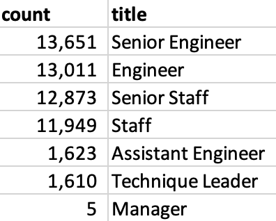
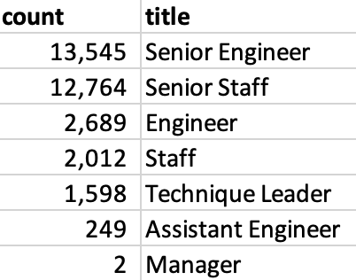
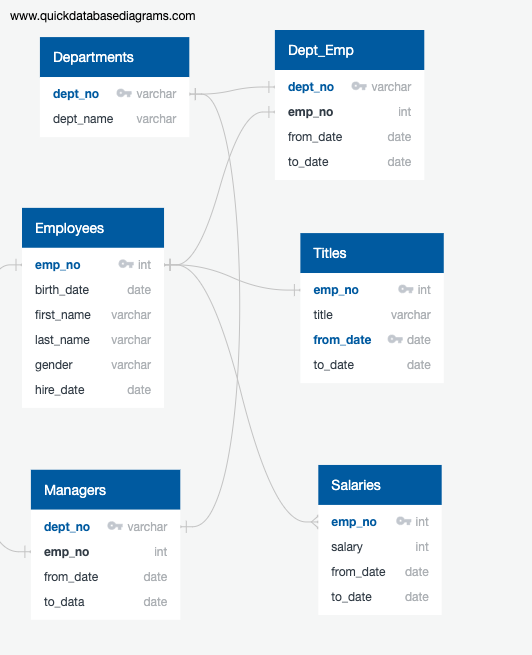

# Pewlett-Hackard-Analysis
Create entity relationship diagrams, perform data modeling, and complete analysis on an employee database using SQL techniques.

---

# Project Summary
The Humans Resources (HR) Department at Pewlett Hackard is preparing for several employee retirements, but they were unsure how many or which departments they work. A quick query helped inform HR that they have 33,118 current employees who are eligible for retirement. These current retire-eligible employees can be found here: Project/Data/tbl_current_emp.csv. 

All of these current retire-eligible employees have held different positions at Pewlett Hackard. According to the table below, nearly 14,000 and roughly 13,000 had senior engineer and engineer positions, respectively. Following this group, almost 13,000 and 12,000 had senior staff and staff positions, respectively. It was interesting to see that there were only a handful of manager positions. This could be a good opportunity for HR to investigate why there were so few managers.

A good number of employees have been with Pewlett Hackard for a very long time because they worked their way up, and received promotions. Given their promotional ladders, it was important to narrow down the table above to better determine an employee's most recent position prior to retirement. As demonstrated in the table below, there will be over 13,500 senior engineers and a little over 12,700 senior staff leaving the company to retire. These employeees can be found here: Project/Data/tbl_unique_titles_retiring.csv.

In light of these upcoming retirements, HR is also considering a mentorship program and wanted to get a better idea of which employees would be good candidates for mentoring. A quick query helped inform HR that there are 1,549 employees who are eligible to be mentors according to their criteria. The table provides a list of these employees and shows how long they have between with Pewlett Hackard as well as their positions in the company. It can be accessed here: Project/Data/tbl_mentor_ready.csv.

## ERD schema
The image below is the ERD schema that was used to build queries for this challenge.

## Code and Outputs
* Refer to "Project" folder for .sql file for queries
* Refer to "Project > Data" folder for .csv files for examples of each output
