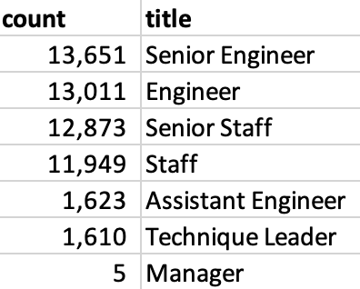
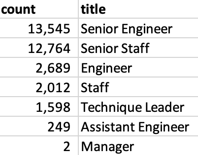

# Pewlett-Hackard-Analysis
Create entity relationship diagrams, perform data modeling, and complete analysis on an employee database using SQL techniques.

---

# Challenge

## Project Summary
The Humans Resources (HR) Department at Pewlett Hackard is preparing for several employee retirements, but they were unsure how many or which departments they work. A quick query helped inform HR that they have 33,1118 current employees who are eligible for retirement. All of these employees have held different positions at Pewlett Hackard. According to the table below, nearly 14,000 and roughly 13,000 had senior engineer and engineer positions, respectively. Following this group, almost 13,000 and 12,000 had staffing positions. It was interesting to display that there were only handful of manager positions.

A good number of employees have been with Pewlett Hackard for a long time because they have received promotions. Given their promotional ladders, it was important to narrow down the table above to better determine an employee's most recent position prior to retirement. As demonstrated in the table below, there will be over 13,5000 senior engineers and 12,700 senior staff leaving the company to retire. 

Lastly, HR is considering a mentorship program and wanted to get a better idea of which employees would be good candidates for mentoring. A quicky query helped inform HR that there are 1,549 employees who are eligible to be mentors according to their criteria. The tbl_mentor_ready.csv table provides a list of these employees and shows how long they have between with Pewlett Hackard as well as their positions in the company.

## ERD schema

## Code and Outputs
* Refer to "Challenge" folder for .sql file for queries
* Refer to "Challenge > Data" folder for .csv files for examples of each output.

Create a technical report in markdown format that contains the following:
* Brief project summary
* PNG of your ERD
* Code for the requested queries, with examples of each output

When writing your project summary, use your own words to describe the purpose of the queries used (for example, determining how many employees are retiring) and what you observed through your results.

And then the report asks you to summarize (not write queries for) the counts of employees retiring, how many will be hired, and how many are eligible for the mentorship program
